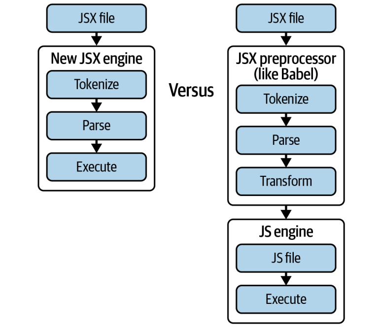

# JSX
> JavaScript Syntax Extensions.

+ Allows devs to write HTML like code within their JS code.
+ Transformed into regular JS by a compiler or transpiler.
### Benefits
+ Easier to read and write 
+ Improved security (Sanitizing)
+ Strong typing
+ Encourages component-based architecture
+ Widely used

### Under the hood
#### Tokenization
+ Breaking up a string of characters into meaningful tokens.
+ Each token called (lexer) contains state about its parents or children.
+ lexers have lexer rules that. Use a regular or similar to detect key tokens like variable names, object keys, values and more in a text string to representing a programming language.
+ EG: `const` becomes 0, `let` becomes 1, `function` becomes 2, ect..
#### Parsing
+ Taking the tokens and converting them into a syntax tree represents the structure of code becomes JSON object.
+ Language engines use these data structures to complete the process with the third step
#### Code generation
+ Compiler generates machine code from the abstract syntax tree(AST) into series of instructions that can be executed directly by computer's processor

#### Several types of compiler
##### Native compilers
> Produce machine code that can be executed directly by the target platform's processor. Used to create standalone applications or system-level software.

##### Cross-compilers
> Produce machine code for a different platform that the one on which the compiler is running. Used in embedded systems development or when targeting specialized hardware.

##### Just-in-time (JIT) compilers
> Translate code into machine code at runtime, rather than ahead of time. offer significant performance.

##### Interpreters
> Execute source code directly, without the need for compilation. Slower than compilers but offer greater flexibility and easy of use.

---
## Optimized Executed
> To execute JS code efficiently, many modern environments, including web browsers utilize JIT compilers. In these systems, JS source code might first be translated into an intermediate representation such as byte code.
> 
> The JIT compiler dynamically compiles this bytecode into machine code as the program runs.
---
## How can we deal with new syntax before it reach engine?

JSX cannot be used directly in the browser, instead requires a `build step` where a custom parser runs against it, then compiles it into a syntax tree.
This code is then transformed into vanilla JS in a final. This is called transpilation: transformed, then compiled code.

### Transpilation
> The process of taking source code written in one language and transforming it into another language that has a similar level of abstraction. `source -> source`
> 
> It's type of `translator`. Refer to a compiler, assembler, or interpreter
> 
> For examples:
> + `Typescript` is a high-level language transpiled `JavasSript` another high-level language.  
> + Babel's transpilation of ES6 to ES5

### The JSX pragma
Unrecognized character in JS when used outside of comparison operations, it throws a SyntaxError.  
> JSX pragma can be transpiled into a function call, compiler directive to provide additional information to the compiler. Tell the compiler how it should handle some contents of file.

# Q&A
### What is JSX? What are some of its pros and cons?
> JSX is Javascript Syntax eXtension, allows writes HTML into JS
> 
> Pros:
>  + Easier to read & write
>  + Improved security
>  + Strong typing
>  + Encourages component-based architecture
>  + Widely used
>
> Cons:
>  + Learning curve
>  + Requires tooling
>  + Mixing of concerns
>  + Partial JavaScript compatibility

### How does a string of text become machine code?
> + Breaking up string of character into meaning ful tokens
> + The Parser taking tokens and parse Abstract Syntax Tree (AST)
> + Language engines use these data structure to generates machine code.  