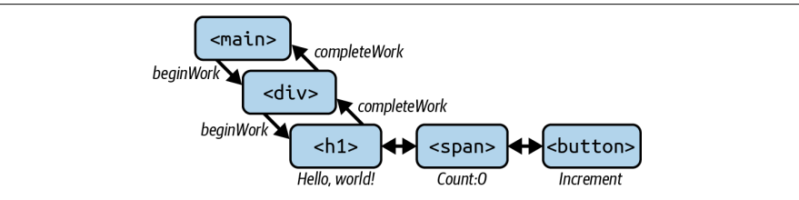

# Reconciliation
> JSX becomes a tree of React elements, and transpiled to AST (JSON). This tree is now committed to the browser using
> minimal calls to imperative DOM APIs. 

## Batching
```javascript
function Example() {
    const [count, setCount] = useState(0)
    const handleClick = () => {
        setCount((prev) => prev + 1)
        setCount((prev) => prev + 1)
        setCount((prev) => prev + 1)
    }
    return (<div>
        <p>{count}</p>
        <button onClick={handleClick}>Increment</button>
    </div>)
}
```
With batches update, React makes one update to the DOM with `count + 3` instead of three updates to the DOM with `count + 1` each time.

To calculate the most efficient batched update to the DOM:
+ React will create a new vDOM tree as a fork of current vDOM tree with updated values, where count is `3`.
+ This tree will need to be `reconciled` with what is currently in the browser. `0 -> 3`
+ React will then calculate that just one update is required to the DOM using the new vDOM value 3 instead updating DOM three times.

### Prior Art
> React used a stack data structure for rendering.
> Stack is a linear data structure that follows LIFO principle. `stack#pop && stack#push` 

### Stack Reconciler
+ Updates executed in the order they were received which means less important updates could block more important updates.
+ Did not allow updates to be interrupted or cancelled which means no guarantees it could work well with various priorities by bailing out of unimportant work when a high priority update was scheduled
+ Presented a number of challenges as application grew in size and complexity

### Fiber Reconciler
> Represents a single unit of work for the reconciler. Fiber are created from React elements, stateful and long-lived.
+ Allows updates to be prioritized and executed concurrently which improves perf and responsiveness.
+ Each instance of a Fiber node including props, state and child components, it also contains information about its position in tree, as well as metadata that used to prioritize and execute updates.
+ Comparing the current with the next Fiber Tree and figuring out which nodes need to be updated, added, or removed.
 
During reconciliation process: 
+ Fiber reconciler creates a Fiber node for each React element in Virtual DOM.
+ Once Fiber nodes have been created, it uses a `work loop` to update UI.
+ Starts at root Fiber Node works its way down the component tree.
+ Marking each Fiber Node as `dirty` if it needs updated.
+ Once reaches the end, it walks backup, creating a new DOM tree in memory.

### Double buffering
> Technique involves creating two buffers (or memory spaces) for sorting images or frames and switching between them at regular intervals to display a final image or video.

+ First buffer is filled with the initial image or frame.
+ While first buffer is being displayed, the second buffer is updated with new data or image.
+ When second is ready, it is switched with the first buffer and displayed on the sceen.
+ Process continues, with the first and second buffers being switched at regular intervals to display final image or video.

> Fiber reconciliation is similar, the current Fiber tree is forked and updated to reflect the new state of a given user interface -- `rendering`. Then when alternate tree is ready and accurately relfects the state a suer expects to see. it's swapped with the current -- `commit`
> 
#### Benefit: 
+ Avoid making unnecessary updates to the real DOM
+ Compute the new state of a UI off-screen and throw it way if a new higher priority update needs to happen.
+ Pause or resume without messing up what the user currently sees.

##### Render phase

+ `Beginwork` is responsible for setting flags on Fiber nodes in the work-in progress tree about whether they should update.
+ Recursively goes to the next Fiber node, doing the same thing until in reaches the bottom of the tree.
+ When it finished, we start calling `CompleteWork` and walk backup
+ `completeWork` is responsible for constructing a new tree to be committed to the host env.
+ React just creating the next versions of the UI off-screen, it can be thrown away in case some higher-priority update get scheduled.


##### Commit phase
> Responsible for updating the actual DOM with the changes that were made to virtual DOM during the render phase.
> The commit phase is divided into two parts 
> 
> Ensure that React Apps are fast, responsive, and reliable, even as they become more complex and handle larger amount of data.
> 

**Mutation Phase**
> React identifies updates that need to be make and calls a special function called `commitMutationEffects`
> 
> `func commitMutationEffects(Fiber) -> update DOM/Text or call lifecycle...`
> 

**Layout Phase**
> Responsible for calculating the new layout of update nodes in DOM and calls `commitLayoutEffects`
> 
> Once layout phase is complete, React successfully updated the actual DOM to reflect the changes from Virtual DOM during the render phase.
> 

##### Effects
+ `Placement Effects`: New component is added to the DOM. 
+ `Update Effects`: Component is updated with new props and state.
+ `Deletion Effects`: Component is removed from the DOM.
+ `Layout Effects`: Before the browser has a chance to paint and are used to update the layout of the page.

## Q&A
1. What is React reconciliation?
> React take Virtual DOM (blueprint of out desired UI state) and make it reality in host environment: web-browser, shells, native platform, ect.
> through process called `reconciliation`

2. What's the role of Fiber data structure?
> Allows updates to be prioritized and executed concurrently, it representation of a component instance and its state in React componenet.
> 
> It is designed to be mutable instance and can be updated and rearranged as needed during the reconciliation process.
> 
3. Why do we need two trees?
> Avoid making unnecessary updates, compute the new state of a UI off-screen, can be throw away if a higher-priority happen.
> We just need to updated in the `work-in-progress [VDOM]` tree, and this will update to the actual DOM in commit phase.

4. What happens when an application updates?
> Rendering process will be run first and when it is complete, React calls `commitRoot` to applied made from `workInProgress` to actual DOM, making the workInProgress tree the new currentTree
> 